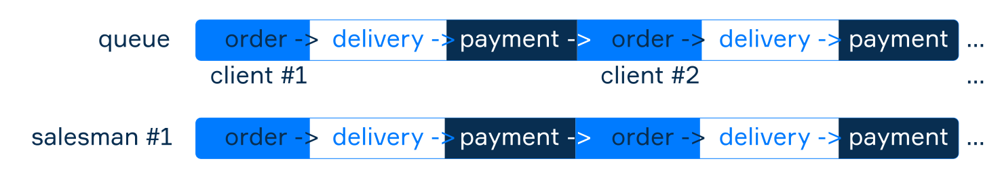
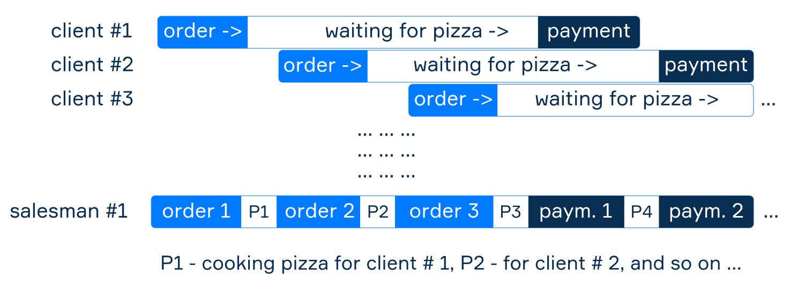
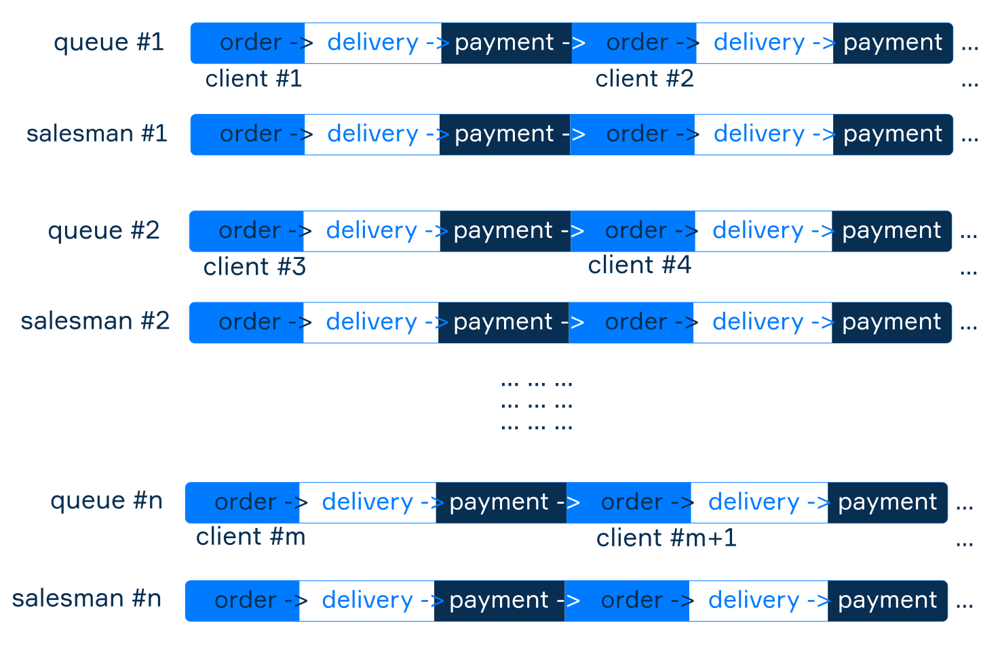

### Synchronous, asynchronous, parallel

- When we are considering some complex process, let's call it workflow. Sometimes actions go one by one, sometimes they go in random order overlapping each other, and sometimes things go simultaneously and in parallel.
- The workflow can evolve differently
- There are three sorts of workflow executions sequence: synchronous, asynchronous, and parallel.

### Synchronous
- A synchronous task blocks the whole process till the task is completed

### Asynchronous
- Asynchronous is a non-blocking architecture, so the execution of one task isn’t dependent on another. Tasks can run simultaneously.

### Synchronous vs Asynchronous
- Synchronous is a blocking architecture, so the execution of each operation depends on completing the one before it. Each task requires an answer before moving on to the next iteration.
  - Asynchronous processing: multiple requests can be processed simultaneously.
  - Asynchronous processing uses buffer and signals to process the requests.
  - Synchronous processing doesn't require signals, the request are processed immediately.

### Parallel
- As the pizza shop sales are growing, now one worker is not enough for the whole business. So, we should hire several. If each seller has a separate compact oven for preparing exactly one pizza at a time, then we can divide the queue of buyers among the sellers.

Now each of them works independently, and this is a case of parallel processing. Each task in parallel processing is running in a continuous period as a whole unit process. Parallel execution is possible only if there is more than one executor. Cashiers in a supermarket are an example of parallel processing in everyday life, as well as highways.